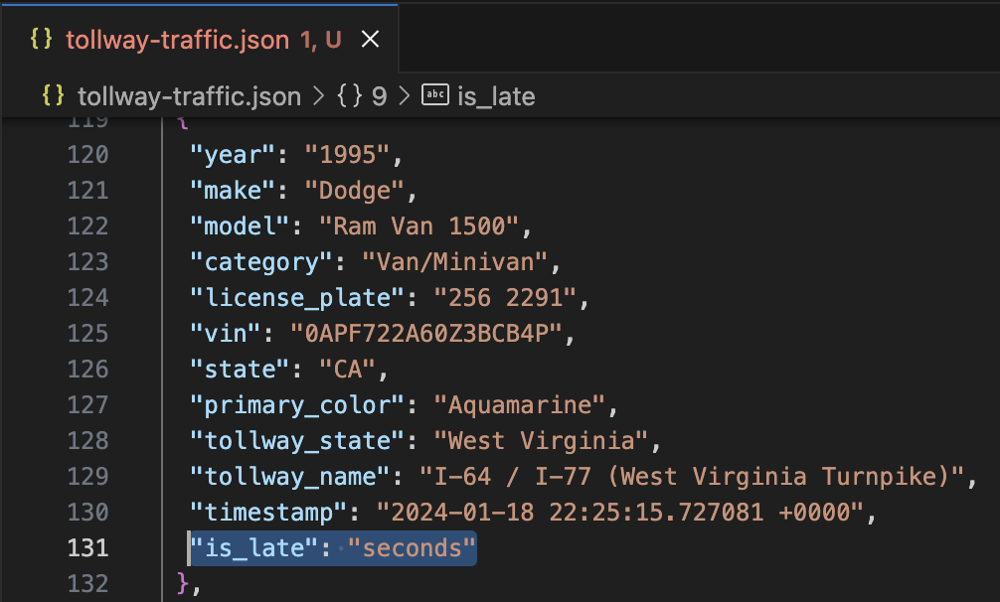
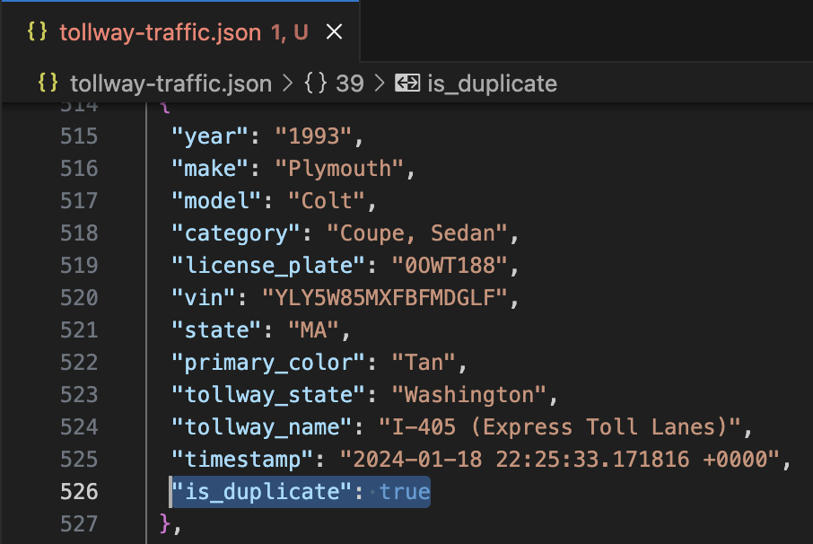

## General Info

The purpose of Tollway Traffic is to simulate the generation of streaming data that can be used for various/learning purposes.

In the United States, when entering a tollway cameras will take a picture of each vehicle's license plate, and that information is used to identify the registered owner of the vehicle along with vehicle metadata such as make, model, year.

Tollway traffic generates a message made up of the following properties:

- `year` - vehicle year
- `make` - vehicle manufacturer (e.g. Toyota, Honda, BMW)
- `model` - vehicle model (e.g. Land Cruiser, Civic, M5)
- `category` - vehicle category (e.g. Coupe, SUV, Sedan)
- `license_plate` - vehicle license plate
- `vin` - vehicle identification number
- `state` - vehicle state
- `primary_color` - vehicle color
- `tollway_state` - state of the tollway
- `tollway_name` - name of the tollway
- `timestamp` - timestamp for when vehicle entered tollway

Each message is meant to represent an event of the process defined earlier. `Faker` is used to generate vehicle information while a web scraper is used to fetch names of tollways in each state/territory within the United States.

While streaming sources can be complex, I tried to include a few basic features:

1. Creation of late events
2. Creation of duplicate events
3. Basic Pub/Sub functionality so that events can be delivered to a Pub/Sub topic (please see installation steps below)

Here is a list of the parameters and a high-level description of each one:

- `--total-events` - number of events to generate
- `--event-rate` - rate at which events are created
- `--output-file` - write events to a local file/log
- `--output-filename` - provide your own JSON filename
- `--include-late-seconds` - create events that are seconds late
- `--include-late-minutes` - create events that are minutes late
- `--include-late-hours` - create events that are hours late
- `--include-late-days` - create events that are days late
- `--include-duplicate` - create duplicate events
- `--pubsub` - push events to pubsub topic


## Installation
1. Create virtual environment
```
$ python3 -m virtualenv .venv
```

2. Activate virtual environment
```
$ source .venv/bin/activate # Mac/Linux
$ .venv\Scripts\activate # Windows
```

3. Install dependencies
```
$ pip install -r requirements.txt
```

4. (Optional) Copy .env-template
```
$ cp .env-template .env
```

5. (Optional) Configure environment variables in `.env`

In the `constants` module, default values are provided for `LATE_SECONDS_RATE`, `LATE_MINUTES_RATE`, `LATE_HOURS_RATE`, `LATE_DAYS_RATE`, `INCLUDE_DUPLICATE_RATE`, and `ALL_EVENTS_COUNT`. If you would like to override these values, you can do so using `.env`. For example, `LATE_SECONDS_RATE` has a default value of 10. If you wanted to change this value to 20, then head over to `.env` and update `LATE_SECONDS_RATE` to 20 so `LATE_SECONDS_RATE=20`. Below is a brief description for these environment variables:

- `LATE_SECONDS_RATE` controls the seconds-late event generation rate so for every *n* events one seconds-late event will be created. Default value is 10.
- `LATE_MINUTES_RATE` controls the minutes-late event generation rate so for every *n* events one minutes-late event will be created. Default value is 20.
- `LATE_HOURS_RATE` controls the hours-late event generation rate so for every *n* events one hours-late event will be created. Default value is 30.
- `LATE_DAYS_RATE` controls the days-late event generation rate so for every *n* events one days-late event will be created. Default value is 100.
- `INCLUDE_DUPLICATE_RATE` controls the duplicate event generation rate so for every *n* events one duplicate event will be created. Default value is 50.
- `ALL_EVENTS_COUNT` is used to track events generated/for logging purposes. Default value is 250.

6. (Optional) Enable pubsub functionality

To allow for the delivery of events to pubsub, please complete the following:

- Set up a Google Cloud Project
- Within your Google Cloud Project, create a service account for pubsub
    - Download the service account key
    - Change the filename to something easy to use such as `pubsub.json`
    - Remove `pubsub-template.json` from `service_account/` directory
    - Move `pubsub.json` to the `service_account/` directory
- Install Terraform (please [follow this link](https://developer.hashicorp.com/terraform/tutorials/aws-get-started/install-cli) for reference)

Terraform is used to handle the creation/deletion of Google Cloud resources. To review/configure the setup, please navigate to `/terraform` where you will find two files: `main.tf` and `variable.tf`.

Next, please provide values for the following environment variables:

- `PROJECT_ID` - Google Cloud Project ID
- `TOPIC_ID` - pubsub topic name
- `PUBSUB_SERVICE_ACCOUNT` - Path to pubsub service account key such as `/service_account/pubsub.json`
- `GOOGLE_REGION` - Name of Google Geographical Region

Last, leverage Terraform setup commands in `Makefile`:

```
$ make tf-init        # initialize the working directory
$ make infra-up-plan  # creates an execution plan allowing you to preview the changes
$ make infra-up       # executes the actions proposed in the execution plan
$ make infra-down     # destroys all remote objects managed by a particular configuration
```

## Running
For usage and options/parameters detail
```
$ python3 -m tollway --help
```

Using `--total-events` generate 100 events
```
$ python3 -m tollway --total-events 100
```

Using `--total-events` and `--event-rate` generate 500 events at a rate of 50 milliseconds
```
$ python3 -m tollway --total-events 500 --event-rate 0.05
```

Using `--total-events` and `--output-file` generate 250 events and log each event to a local file
```
$ python3 -m tollway --total-events 250 --output-file
```

Using `--total-events` generate 10,000 events and enable `--include-late-seconds`
```
$ python3 -m tollway --total-events 10000 --include-late-seconds
```

Using `--total-events` generate 20,000 events and enable `--include-late-minutes` along with `--include-duplicate`
```
$ python3 -m tollway --total-events 20000 --include-late-minutes --include-duplicate
```

Using `--total-events` generate 1,000 events and enable `--include-late-seconds`, `--include-late-minutes`, `--include-late-hours`, and `--include-late-days`
```
$ python3 -m tollway --total-events 1000 --include-late-seconds --include-late-minutes --include-late-hours --include-late-days
```

To enable `--pubsub`
```
$ python3 -m tollway --total-events 100 --pubsub
```

## Identify Late and/or Duplicate Events
If you would like to have more into the late and/or duplicate events that have been created, you can do so by enabling the `--output-file` option with any of the `--include-late` and `--include-duplicate` options. Enabling `--output-file` will write all events to a json file and all late and/or duplicates events will have additional references.
- Late events will have the key `is_late` with time unit (seconds, minutes, hours, days) as the `value`.
- Duplicate events will have the key `is_duplicate` with a `value` of `true`.

Below are a couple examples:

### Late Event



### Duplicate Event

